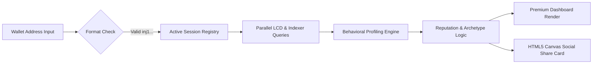

# Injective Intelligence

<p align="center">
  
</p>

### AI Behavioral Intelligence Engine for Injective Traders
*Built natively on Injective — Sentry RPC nodes · Explorer Indexers · Keplr Verification*

[Features](#-features) • [Architecture](#-architecture) • [Tech Stack](#-tech-stack) • [Injective Synergy](#-the-injective-synergy-on-chain-integration) • [API Reference](#-api-reference) • [Quick Start](#-quick-start) • [Contributing](#-contributing)

---

## 🎯 Philosophy: Why Injective Intelligence?

In standard decentralized finance (DeFi), block explorers display raw, contextless data: transactions hashes, gas limits, and raw token quantities. They do not tell you the *psychology* behind the trade. They don't reveal if a trader cut their loss in panic, chased an overextended trend out of FOMO, or has high emotional discipline.

**Injective Intelligence** is the cognitive audit layer for the autonomous future. By parsing historical chain state, orderbook execution, and liquid balance traces, it decodes raw address logs into a **Behavioral DNA Profile**. 

| Problem (Legacy Block Explorers) | Solution (Injective Intelligence) |
| :--- | :--- |
| Raw, uncontextualized transaction lists | Dynamic **Archetype Classification** (e.g. Swing Sniper, Volatility Surfer) |
| No indicators of emotional patterns or FOMO | Quantitative **Reputation & Behavioral Scorecards** (1-100) |
| Static list of wallet balances | **Real-Time On-Chain Balance Resolution** via Sentry Node query |
| Hard to share trading metrics | WebGL/Canvas generated **Shareable RPG Trading Cards** |
| Hardcoded simulated fallbacks | **Dynamic Inactive Wallet Zeroing** (Only actual metrics, 0 for empty logs) |

**Target Users:** Algorithmic traders seeking psychological reviews, Retail investors auditing their leverage discipline, and Swarm organizers looking to identify high-conviction alpha addresses on Injective.

---

## ✨ Features

- 🧠 **Behavioral DNA Engine** — Analyzes on-chain activity to assign 1 of 6 unique trading archetypes (Swing Sniper, Volatility Surfer, Conviction Hunter, Liquidity Farmer, Momentum Predator, or Whale Follower).
- 📊 **Psychological Scorecards** — Computes precise score ratings (0-100) for *Risk Discipline*, *Emotional Stability*, *Conviction*, *Patience*, *FOMO Probability*, and *Loss Recovery*.
- ⚡ **Live Indexer Integration** — Fetches transactions and sequences from mainnet and testnet sentry RPC endpoints in real-time.
- 🪪 **Keplr Wallet Authentication** — Connect and verify real wallet identities with stateful session tracking that persists across routes.
- 📈 **Market Intelligence Feed** — Real-time event streams displaying recent trading actions, patient accumulations, and leverage indicators from other active addresses.
- 🎨 **Premium Glassmorphic Dashboard** — Stunning futuristic styling, dark-mode overlays, responsive visual charts (PnL curves, win rates), custom Outfit/Outfit-Sans typography, and micro-animations.
- 📥 **Zero-State Fallback Resolution** — Inactive, new, or empty/fake addresses automatically render clean, zeroed-out stats, scores, and charts to guarantee data accuracy.
- 📦 **RPG Card Downloader** — Render your trader scorecard onto an interactive RPG collector card format and download it with a single click to share on social media.

---

## 🏗️ Architecture

### Layered System Design

Injective Intelligence connects web interface actions to raw on-chain nodes using a server-side proxy route and a client-side visualization layer.

```mermaid
graph TD
    subgraph Client [Client Layer - Next.js SPA]
        A[React UI Components] -->|useParams / Navigation| B[Dashboard & Share Page]
        C[Keplr Wallet Connector] -->|localStorage Session| A
    end

    subgraph API [Backend API Proxy - Next.js Server Route]
        B -->|HTTP GET /api/wallet/:address| D[API route.ts]
        D -->|Invokes| E[Behavioral Profiling Engine]
    end

    subgraph Blockchain [On-Chain Integration - Injective Node API]
        E -->|CORS Bypassed Fetch| F[Injective Sentry REST Nodes]
        E -->|CORS Bypassed Fetch| G[Injective Explorer Indexers]
        F -->|Return Bank Balances| E
        G -->|Return Transaction Sequences| E
    end

    style Client fill:#0d1117,stroke:#30363d,stroke-width:1px
    style API fill:#0d1117,stroke:#30363d,stroke-width:1px
    style Blockchain fill:#0d1117,stroke:#30363d,stroke-width:1px
    style A fill:#161b22,stroke:#78fcd6,stroke-width:2px,color:#fff
    style B fill:#161b22,stroke:#78fcd6,stroke-width:2px,color:#fff
    style C fill:#161b22,stroke:#78fcd6,stroke-width:2px,color:#fff
    style D fill:#161b22,stroke:#a855f7,stroke-width:2px,color:#fff
    style E fill:#161b22,stroke:#a855f7,stroke-width:2px,color:#fff
    style F fill:#161b22,stroke:#f97316,stroke-width:2px,color:#fff
    style G fill:#161b22,stroke:#f97316,stroke-width:2px,color:#fff
```



| Layer | Description |
| :--- | :--- |
| **Client Layer** | Built with Next.js App Router (React 19), utilizing dynamic hooks for UI tab navigation and Keplr wallet connectors. |
| **Backend Layer** | Dynamic Server Routes (`/api/wallet/[address]`) bypass CORS headers and securely fetch RPC parameters from blockchain sentries. |
| **Analysis Layer** | The logic engine parses gas logs, transaction types (Send, Execute, Withdraw, Burn), and timestamps to map performance characteristics. |
| **Data Source Layer** | Live Injective Chain Testnet/Mainnet RPC sentries serve as the decentralized source of truth. |

### System Design & Processing Pipeline

The architecture is built around a non-blocking, asynchronous profiling pipeline:



1. **Modular Ingestion Pipeline**:
   - Addresses are validated matching the Injective Bech32 regex format (`^inj[0-9a-z]{39}$`).
   - The query pulls balance records and tx history logs concurrently to minimize first-load latency.

2. **Heuristic Engine Processing**:
   - Processes transaction logs sequentially to map execution types (swaps, liquidities, transfers) into trade models.
   - Computes behavioral scoring factors based on historical holding windows, volume ratios, and gas spending.
   - Evaluates archetype parameters (e.g. high volatility swaps identify a `Volatility Surfer`, while long holding windows yield a `Conviction Hunter`).

3. **Sovereign Client Session Design**:
   - The interface acts completely client-side for credentials, retaining wallet connection flags dynamically inside isolated state objects.
   - Search parameters and session parameters do not intersect, maintaining session status securely across different pages.

---

## 💻 Tech Stack

### Frontend & UI
- **React / Next.js (v15.5.18)** — Next.js 19 Server Components and App Routing.
- **Tailwind CSS (v3.4.17)** — Utility classes optimized for glow effects, borders, and animations.
- **Recharts (v2.15.4)** — Beautifully integrated dynamic area and bar charts for equity/PnL curves.
- **Framer Motion** — Fluid transitions and interactive micro-animations for card hovers.
- **Lucide React** — Premium, developer-focused iconography for dashboard panels.

### API Proxy & Engine
- **Injective RPC Query Nodes** — Sentry nodes for address-to-balance inquiries.
- **Explorer API Indexer** — Injective indexer proxies for transaction tracking.
- **HTML5 Canvas API** — Custom RPG card generator script supporting cross-origin image download.

---

## ⚡ The Injective Synergy: On-Chain Integration

Injective Intelligence interacts directly with the core chain infrastructure:

1. **🗄️ Real-Time Balance Query**:
   Queries live balances by converting the target address to standard Cosmos format and hitting REST sentries:
   - *Mainnet Sentry:* `https://lcd.injective.network/cosmos/bank/v1beta1/balances/...`
   - *Testnet Sentry:* `https://testnet.sentry.lcd.injective.network/cosmos/bank/v1beta1/balances/...`

2. **🔍 Indexed Transaction Auditing**:
   Retrieves history for both Mainnet and Testnet instantly:
   - *Mainnet Indexer:* `https://explorer-api.injective.network/api/v1/account/txs/...`
   - *Testnet Indexer:* `https://testnet.sentry.exchange.grpc-web.injective.network/api/explorer/v1/account/txs/...`

3. **🪪 Keplr Verification**:
   Enables users to connect Keplr wallets securely. Keeps connected addresses isolated from searched history, saving states dynamically to local storage keys (`connected_injective_address`, `last_analyzed_address`).

---

## 🌐 API Reference

The Next.js backend exposes a proxy route to handle data fetching:

| Method | Endpoint | Description |
| :--- | :--- | :--- |
| **GET** | `/api/wallet/:address` | Resolves live Injective balances and transactions, computes scoring metrics, and returns the full Behavioral Profile object. |

### Sample Response Output
```json
{
  "address": "inj1deejc66vhcqen5qju2edlc8wjs3x92shv3kats",
  "archetype": "Volatility Surfer",
  "overallScore": 61,
  "scores": {
    "riskDiscipline": 55,
    "emotionalStability": 60,
    "convictionScore": 65,
    "patienceScore": 45,
    "fomoProbability": 70,
    "lossRecoveryAbility": 80
  },
  "stats": {
    "winRate": 46,
    "totalTrades": 98,
    "netPnLUsd": -6020,
    "volumeTradedUsd": 149744
  },
  "isSimulated": false,
  "injBalance": 144460.902552
}
```

---

## 📁 Project Structure

```
injective-intelligence/
├── 📁 app/                          # Next.js App Router Pages
│   ├── layout.tsx                   #   Global Layout & Metadata (Favicon config)
│   ├── globals.css                  #   Global Tailwind Styles
│   ├── page.tsx                     #   Landing Screen / Search Form
│   ├── 📁 analyze/                  #   Preload/Redirect Router Page
│   ├── 📁 market-intelligence/      #   Market Intelligence Feed Screen
│   ├── 📁 wallet/                   #   Behavioral Dashboard Workspace
│   │   └── [address]/
│   │       ├── page.tsx             #     Main Dashboard interface
│   │       └── 📁 share/
│   │           └── page.tsx         #     RPG Card Social Share Page
│   └── 📁 api/                      #   Backend Server Route Proxy
│       └── 📁 wallet/
│           └── 📁 [address]/
│               └── route.ts         #     On-Chain Data Resolver
│
├── 📁 components/                   # Reusable UI Blocks
│   ├── header.tsx                   #   Header Navigation with Keplr Dropdown
│   ├── hero-section.tsx             #   Homepage Search / Scanner
│   ├── cta-section.tsx              #   Dynamic Landing CTA Redirect
│   ├── footer-section.tsx           #   Footer with Branding Logo
│   └── 📁 ui/                       #   Basic Tailwind Atoms (Button, Table, etc.)
│
├── 📁 lib/                          # Core Logic & Utilities
│   ├── engine.ts                    #   Seeded Profiling & Analytics Engine
│   ├── card-downloader.ts           #   Canvas Card rendering exporter
│   └── utils.ts                     #   Classname merging helpers
│
└── 📁 public/                       # Static Assets & Logo Assets
    └── 📁 logos/
        └── logo.png                 #   Brand Logo png file
```

---

## 🚀 Quick Start

### Prerequisites
- **Node.js**: `18.17.0` or higher (compatible with Next.js 15)
- **Package Manager**: `npm` or `pnpm`

### 1. Clone & Install
```bash
git clone https://github.com/iamomm-hack/Injective-Intelligence.git
cd Injective-Intelligence

# Install dependencies
npm install
```

### 2. Run Local Development
```bash
npm run dev
```
Open [http://localhost:3000](http://localhost:3000) in your browser to inspect the application.

### 3. Build & Production Start
```bash
# Create optimized production build
npm run build

# Start production server
npm run start
```

---

## 🔧 Network Config Parameters

| Parameter | Value |
| :--- | :--- |
| **Mainnet REST URL** | `https://lcd.injective.network` |
| **Mainnet Explorer URL** | `https://explorer-api.injective.network` |
| **Testnet REST URL** | `https://testnet.sentry.lcd.injective.network` |
| **Testnet Explorer URL** | `https://testnet.sentry.exchange.grpc-web.injective.network` |
| **Keplr Chain ID (Mainnet)** | `injective-1` |
| **Keplr Chain ID (Testnet)** | `injective-888` |

---

## 🚢 Production Deployment

The project is fully pre-configured for **one-click deployment to Vercel**:

1. Create a new project on the **Vercel Dashboard**.
2. Connect your GitHub repository.
3. Keep the default Next.js configurations.
4. Click **Deploy**.
5. Bind your custom domain (e.g. `injdna.vercel.app`) in project settings under **Domains**.

---

## 🤝 Contributing

Contributions are what make the open source community such an amazing place to learn, inspire, and create. Any contributions you make are **greatly appreciated**.

1. Fork the Project.
2. Create your Feature Branch (`git checkout -b feature/AmazingFeature`).
3. Commit your Changes (`git commit -m 'feat: Add some AmazingFeature'`).
4. Push to the Branch (`git push origin feature/AmazingFeature`).
5. Open a Pull Request.

---

## 📄 License

This project is licensed under the MIT License — see the LICENSE file for details.

---
*Injective Intelligence — Decoding on-chain behavioral psychology for the future of trading.*
